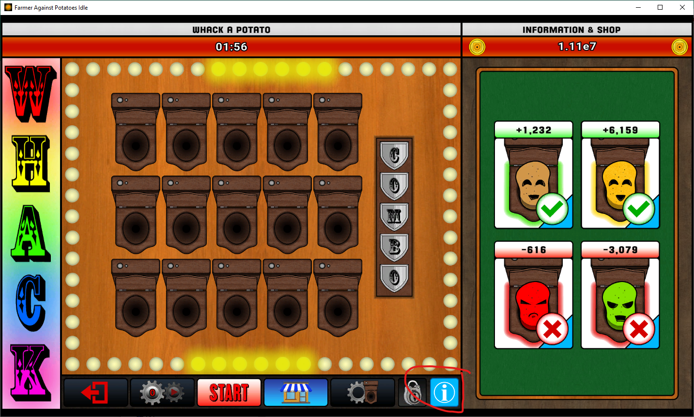
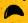
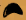

# 🥔 FAPI Whack-A-Potatoe

There is a Steam game called [Farmer Against Potatoes Idle](https://store.steampowered.com/app/1535560/Farmer_Against_Potatoes_Idle/), and it 
contains a game just like the old "whack-a-mole", but with potatoes!

The game is pretty straightforward, there are 2 "good" potatoes that give you 
points, and 2 "bad" ones that take your points. This script checks for good 
potatoes on your **primary** screen and clicks them as fast as possible.

## 📃 Topics
- [🥔 FAPI Whack-A-Potatoe](#-fapi-whack-a-potatoe)
  - [📃 Topics](#-topics)
  - [🚀 How to use the script](#-how-to-use-the-script)
  - [🧑‍💻 How it works](#-how-it-works)

## 🚀 How to use the script

### Requirements
First of all, you need python for this, so download it first.
Then execute the following command to install the needed libraries:
```shell
pip install -r requirements.txt
```

> You might need to use the terminal to run the script. Here are some links to 
> help you, in case you are unfamiliar with the terminal.
>  - [How to enter folders in CMD - Windows](https://www.lifewire.com/change-directories-in-command-prompt-5185508)
>  - [Entering Folders with Terminal - MacOS / Linux](https://sourcedigit.com/27411-how-to-open-a-directory-in-linux-using-terminal/)

### Configuration
Next configure the script to work on your screen. The script uses confidence 
factors, such as if the colors are similar, if the pixels are similar, but it 
also takes size into account! And because of this, the success of the script 
depends on the resolution that your game is running at, which can be anything 
given that the game can run in windowed mode, and you can resize the window as 
you see fit. The following steps will set up the script so it works with the
resolution that your game is running at.
1. Open the whack-a-mole screen so the potato 'toilets' are visible. 
2. Run the script `region_test.py` and check the `img/region_test.png` to 
see what region the script is scanning. Drag/resize the game window and rerun 
the script until all the 'toilets' are visible in `region_test.png`.
It doesn't matter if the game is full screen or not, both will work.
3. With the screen size configured, press the info button until the points per 
potato are visible, like in the image below.

4. Make a screenshot of the eye of the yellow potato and replace `img/eye.png`
with your screenshot. This screenshot should look more or less like this: 

5. Do the same for the brown potato, this time replace `img/eye_normal.png` with 
your screenshot. It should look more or less like this: 
6. Now, the script is ready to run with the resolution that your game is running on.

### Clicking the potatoes
Either in your IDE, or in a terminal, run the script `script.py` to start the
program, for example:
```shell
python script.py
```
This will start the script and show you the keyboard shortcuts to start and stop 
the scanning algorithm. The scanning starts as **STOPPED** by default, so you 
just need to press the start key for it to start clicking those potatoes. 
And when you're not using, just press the stop key.

To actually use the script, go to the whack-a-mole game whenever the timer allows
you to start a new game. Press the shortcut to start the scanning (F8 by default), 
and click the start button in the game. The script will automatically start 
clicking the potatoes as they appear. Sit back and relax while the points are 
coming in.

> Note: there is high variability in how fast the script can click. It all depends
> on how successful the image search is. In any case, the accuracy should be 100%. 

If you want to stop the script entirely, go into the terminal you used to start 
the program and press `Ctrl + C`, it will shutdown the process.

## 🧑‍💻 How it works

The script uses `PyAutoGUI` to handle the image search and screen clicks. It 
basically takes a screenshot of a specific region often as possible and searches 
for a specific image inside that screenshot _(our eye.png)_ taking color and other 
factors into account.

But because the confidence isn't 100%, it will allow the image to be true even 
if some small things are different, so after some testing 0.8 is a good value 
because it can find normal potatoes and the special ones as well, while not 
clicking green or red ones.

It also uses the `keyboard` library to handle keyboard presses, because having 
to `Ctrl + C` while your mouse is clicking everywhere is not a good idea... 
Instead, when you press a specific key _(f8 by default)_ it will start or stop 
the script.

There are multiple images in the img folder because they might be useful incase 
you're doing extra automations, for example automatically starting the round 
when the timer reaches to 0.